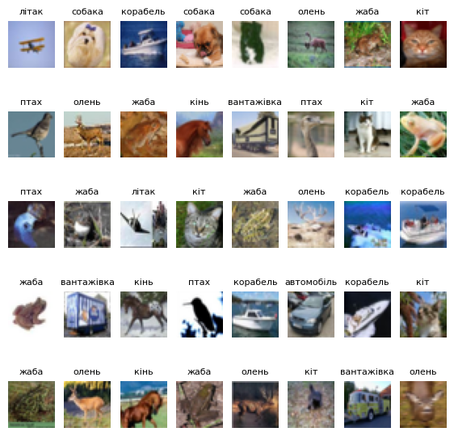
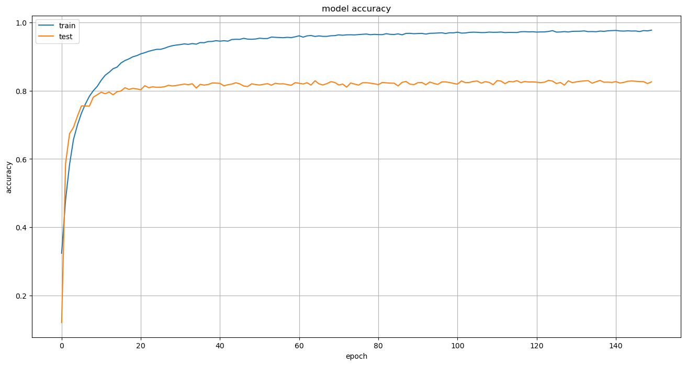
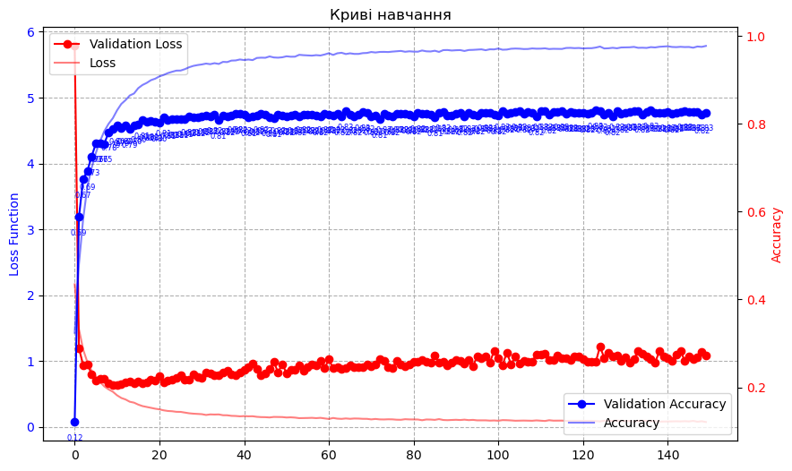
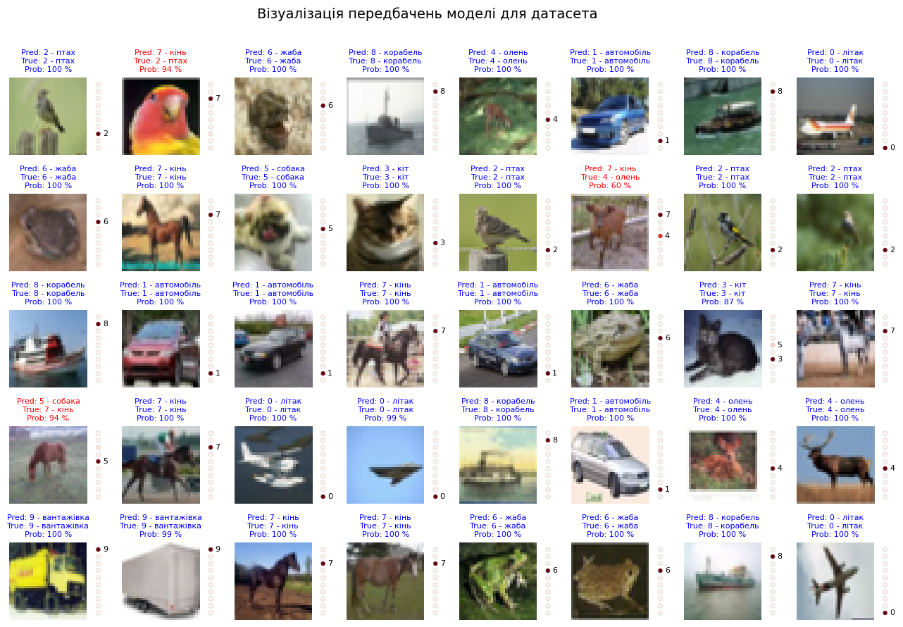

# Проєкт "PhotoRecognitionApp"
<p align="center">
   
   
   
   
   
   
   
   
   
</p>

## Опис моделі

Представлена модель - це нейронна мережа, яка призначена для класифікації зображень. Вона є типовим прикладом згорткової нейронної мережі (CNN) для класифікації зображень, яка використовується в багатьох застосунках у галузі  "Computer vision".

### Архітектура моделі:
1. [ ] BatchNormalization: Цей шар нормалізує вхідні дані, забезпечуючи стабільність та швидкість навчання. Вхідні дані нормалізуються до середнього значення 0 та стандартного відхилення 1.
2. [ ] 
3. [ ] Conv2D: Перший згортковий шар з 64 фільтрами розміром 5x5, що застосовує активацію "elu" та використовує "padding='same'" для збереження розміру зображення.
4. [ ] 
5. [ ] MaxPooling2D: Шар пулінгу з розміром підвибірки 2x2 та зміщенням 2x2, що допомагає зменшити розмірність зображення.
6. [ ] 
7. [ ] Dropout: Шар Dropout, що випадковим чином вимикає частину нейронів з метою запобігання перенавчанню.
8. [ ] 
9. [ ] Аналогічно до пунктів 1-4 повторюються ще два блоки з BatchNormalization, Conv2D, MaxPooling2D та Dropout, з різними кількостями фільтрів (128 та 256).
10. [ ] 
11. [ ] Flatten: Шар, що виконує плоске перетворення вихідних даних з попередніх шарів для передачі їх у повністю з'єднаний шар.
12. [ ] 
13. [ ] Dense: Повністю з'єднаний шар з 256 нейронами та активацією "elu".
14. [ ] 
15. [ ] Dropout: Ще один шар Dropout для регуляризації моделі.
16. [ ] 
17. [ ] Dense: Вихідний шар з 10 нейронами (відповідає кількості класів) та активацією "softmax", яка використовується для отримання ймовірностей принадлежності вхідного зображення до кожного класу.

### Детальний опис шарів та функцій:
* Згорткові шари (Conv2D):
  * Згорткові шари використовуються для виявлення різних особливостей у зображеннях. У цій моделі використовуються три згорткові шари з різними кількостями фільтрів (64, 128 і 256 відповідно). Ці фільтри сканують зображення та відбирають важливі ознаки.
* Підсумкові шари (MaxPooling2D):
  * Підсумкові шари допомагають зменшити просторовий обсяг уявлення, зменшуючи розмірність виходу попередніх шарів. У цій моделі використовуються підсумкові шари з розміром пулу 2x2 та зміщенням 2x2, що дозволяє зменшити кількість параметрів та обчислень.
* Підвідбори (Dropout):
  * Dropout є технікою регуляризації, яка випадковим чином вимикає певні нейрони під час тренування. Це допомагає уникнути перенавчання та поліпшує загальну здатність моделі генералізувати дані, що не були використані під час навчання.
* Повністю з'єднані шари (Dense):
  * Повністю з'єднані шари здійснюють класифікацію зображень на основі властивостей, які вони вивчили з попередніх згорткових та підсумкових шарів. У цій моделі використовуються два таких шари з активацією "elu".
* Функція активації:
  * У всіх шарах, окрім останнього, використовується активація "elu" (Exponential Linear Unit). Це нелинійна функція активації, яка допомагає уникнути проблеми з виціканням градієнту та прискорює збіжність навчання.
* Функція втрати та оптимізатор:
  * Модель використовує функцію втрати "sparse_categorical_crossentropy", яка підходить для задач класифікації з кількістю класів більше ніж два і мітками класів у вигляді цілих чисел. Оптимізатор "Adam" використовується для налаштування параметрів моделі з метою мінімізації функції втрати.

### Результати навчання моделі:
    Використано епох: 150
    Кількість зразків (batch_size): 256
    
    Загальна точність: 98%
    Точність на тестовому наборі: 83%

### Візуалізація моделі:
_Вивід прикладів із набору даних Cifar-10:_



_Графіки кривих навчання моделі:_




_Приклади передбачень за допомогою натренованої моделі:_




## Розміщення на DockerHub 
<a href="https://hub.docker.com/r/ustymenko/data_science/tags">PhotoRecognitionApp</a>

## Установка 💻

1. Для розгортання додатку локально на комп'ютері потрібно завантажити проєкт з репозиторію GitHub.
2. Встановити ```Docker(desktop)```
3. Встановити пакет віртуального оточення ```poetry```
4. Запустити середовище розробки 
5. Створити ```".env"``` файл на основі ```"example.env"```
6. В терміналі виконати команду ```poetry lock```
7. В терміналі виконати команду ```poetry install```
8. В терміналі виконати команду ```poetry sell```
9. В терміналі виконати команду ```docker-compose build```
10. В терміналі виконати команду ```docker-compose up -d```. Якщо щойно було виконано пункт 9, пункт 10 можна пропустити.
11. Передати у контейнер ```".env"``` файл командою ```docker cp .env photorecognitionapp-my_service-1:.env```
12. Виконати створення БД командою в терміналі ```docker exec photorecognitionapp-my_service-1 python create_db.py```
13. Виконати міграції БД командою в терміналі ```docker exec photorecognitionapp-my_service-1 alembic upgrade heads```
14. Також в терміналі запустити серевер командою ```docker exec -d photorecognitionapp-my_service-1 uvicorn main:app --host 0.0.0.0 --port 8080 --reload```
15. Відкрити сторінку в браузері за посиланням ```http://localhost:8080/```
 
## Розробники
<div align="">
  Developer: <a href="https://github.com/OlegDovhyi">Oleg Dovhyi</a><br>
  Developer: <a href="https://github.com/Nevskiy911">Oleksandr Malieiev</a><br>
  Developer: <a href="https://github.com/CadejoBlanko">Oleksandr Martyniuk</a><br>
  Scrum Master/Developer: <a href="https://github.com/GhosteLLoS">Oleksii Medvetskyi</a><br>
  Team Lead/Developer: <a href="https://github.com/UstymenkoOB">Oksana Ustymenko</a><br>
</div>
